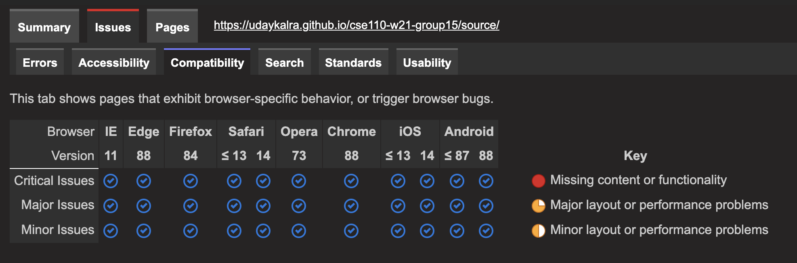
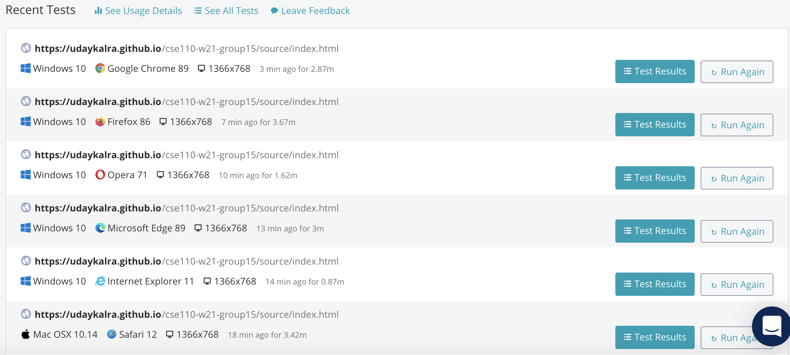

# Browser Diversity Report

## Methods
We conducted cross browser testing by first inputting our files into a browser compatibility tester and checking the results generated. We then performed multiple rounds of manual testing through different browsers. 

## Tools
* [PowerMapper](https://www.powermapper.com/)
  - Runs through files and checks for compatibilty and other accessibility errors
* [LambdaTest](https://www.lambdatest.com/)
  - Runs live manual tests through different browsers
* [CrossBrowserTesting](https://crossbrowsertesting.com/)
  - Runs live manual tests through different browsers
  - Note: This tool has the same functionality as LambdaTest, but both were free trials only. Hence having to use a second cross browser tool.

## Results
* Initially there was an issue regarding the `display: flex` and `overflow-y: scroll` attributes for our task list, causing Safari to improperly render the task list. However, this issue has been fixed.
* There is currently an issue when trying to run our site with Internet Explorer 11. For this browser, the onboarding screen arrows do not work properly and causes the screen to be stuck on the onboarding process.

### Testing Results on Browser Compatibility from PowerMapper:

### Browsers Used for Manual Testing:
